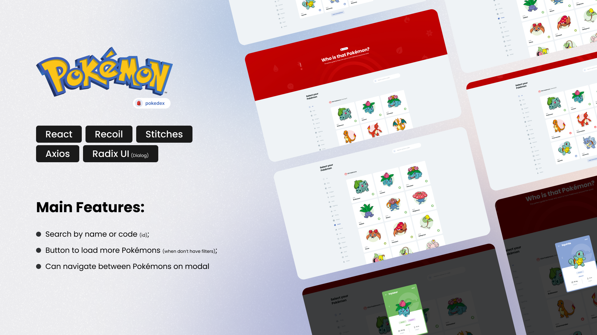

 

## 🛠 Skills

![react][react] ![eslint][eslint] ![comintlint][commitlint] ![prettier][prettier] ![vite][vite]

## 📄 Roadmap

This project is a **Coding Challenge** for a **[Lindy Labs](https://www.linkedin.com/company/lindy-labs/)** opportunity. The requirements for this
**Code Challenge** are:

-   [x] Have a web page that allows a user to enter a Pokémon name;
    -   In my case, I create a grid to show all Pokémons;
    -   If you don't have any filter, you will see 9 Pokémons when start, and if you want you can load 9 more each time you press **Load more
        Pokémons** button.
-   [x] When submitting, query [https://pokeapi.co](https://pokeapi.co) and display the given
        Pokémon (at least name, number and sprite), or an error message if no
        match is found;
    -   When you make a search, first thing I do is validate if my state contains any Pokémon to match with id or name. If not, make a request to **
        [PokeApi](https://pokeapi.co)**;
    -   When return one result, the modal with details will open automatically.
-   [x] Provide “Previous” & “Next” buttons, that switch to the previous/next
        Pokémons, base on their id number;
-   [x] Provide a text-based search feature, where inputting a name or partial
        name should look for a matching Pokémon and show it;
-   [ ] Have at least two automated tests, for the two features above;
    -   **IMPROVEMENT:** this point is an improvement to learn new skills and finish all requirements on this challenge.

### Additional Points

This 3 points are essential on each project I do!

-   [x] **ESLint** configuration;
-   [x] Add **Husky** and **Lint Staged** to run on each commit;
-   [x] Add **Commit Lint** to follow the guidelines on commit messages;

## 💾 Environment Variables

To run this project, you will need to add the following environment variables to your `.env` file:

-   **`VITE_API_URL`:** **PokeApi** Url (`https://pokeapi.co/api/v2/`)

## 🌐 Live Version

## 🔗 More About Me

[react]: https://img.shields.io/badge/react-1E4174?style=for-the-badge&logo=react&logoColor=white
[eslint]: https://img.shields.io/badge/eslint-1E4174?style=for-the-badge&logo=eslint&logoColor=white
[commitlint]: https://img.shields.io/badge/commitlint-1E4174?style=for-the-badge&logo=commitlint&logoColor=white
[prettier]: https://img.shields.io/badge/prettier-1E4174?style=for-the-badge&logo=prettier&logoColor=white
[vite]: https://img.shields.io/badge/vite-1E4174?style=for-the-badge&logo=vite&logoColor=white
